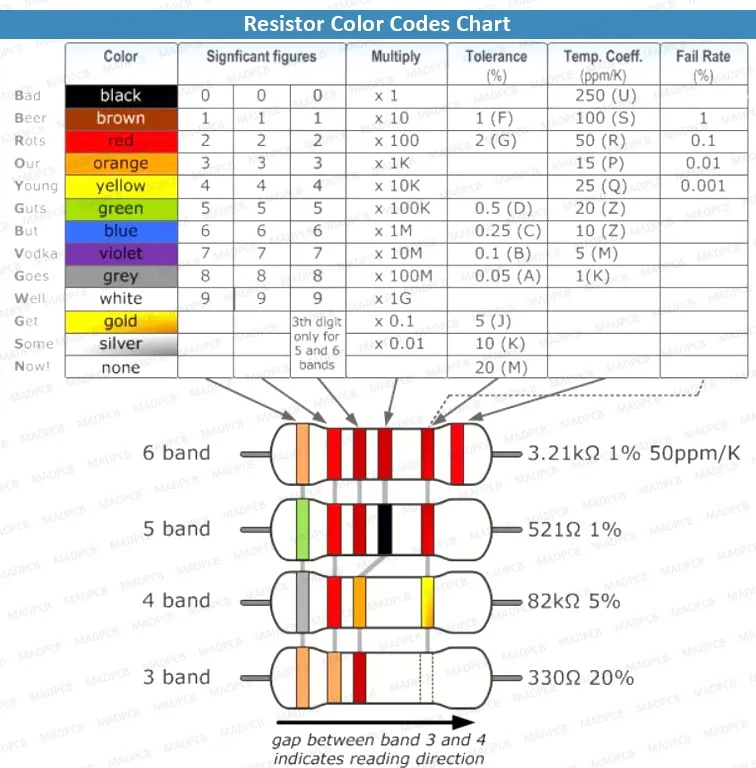

# devbox

Use the Discussions link above to ask questions.

> Warning:
> Connecting things incorrectly can cause things to break.
> 
> Ask if you are unsure.

# Getting started

You need a host computer - macOS or Windows or Linux.

1) Go to the [Moddable SDK - Getting Started](https://github.com/Moddable-OpenSource/moddable/blob/public/documentation/Moddable%20SDK%20-%20Getting%20Started.md) for your host machine.

This will guide you on installing the SDK and building tools.

You can build and run [many examples](https://github.com/Moddable-OpenSource/moddable/tree/public/examples) with the simulator.

We use [`$MODDABLE/examples/piu/balls`](https://github.com/Moddable-OpenSource/moddable/tree/public/examples/piu#balls) as our `helloworld` for devices with screens.

2) Install the [ESP32 tools](https://github.com/Moddable-OpenSource/moddable/blob/public/documentation/devices/esp32.md) or [Pico tools](https://github.com/Moddable-OpenSource/moddable/blob/public/documentation/devices/esp32.md) (or both!)

Now you can build for the MCUs that included in the box.

# whats in the boxes?

Contents:

## MCUs
Recommendation: use one of the two self-contained devices to develop software

### Self contained

- [Moddable Two](https://github.com/Moddable-OpenSource/moddable/blob/public/documentation/devices/moddable-two.md)
	- touch screen
		- esp32 procesor
			- dual processor
			- wifi, bluetooth
	- programmer is necessary
		- make sure the pins on the programmer match the labels on the board.
	- the usb connector onboard can provide power, but not communication
	- use Moddable platform `esp32/moddable_two` like:
		`mcconfig -d -m -p esp32/moddable_two`

- [Waveshare RP2040-Touch-LCD-1.28](https://www.waveshare.com/wiki/RP2040-Touch-LCD-1.28)
	- round touch screen
		- Raspberry Pi Pico processor
	- with breakout adapter
	- use Moddable platform `pico/ws_round_touch`

### Bare
- bare Esp32
	- use Moddable platform `esp32/nodemcu`
- bare Raspberry Pi Pico
	- use Moddable platform `pico`
	- This board was modified with a reset button.
		- the button close to USB port is "boot select" button
		- the soldered on button is the reset button

# Supporting bits
- Bread boards
	- This video describes them a bit:
		[https://www.youtube.com/shorts/05ZrbtwUzMk](https://www.youtube.com/shorts/05ZrbtwUzMk)
- Breadboard power supply
	- jumpers onboard can select 3.3 or 5.0v for either or both power rails
- 5v Wall-wart power brick
- 18650 x2 battery box
	- 18650 is a lithium-ion battery
	- 3.6-3.7v
	- can use with VIN on boards

## components
- LEDs
	- multiple colors
	- different colors need different resistors
	- https://www.gsnetwork.com/led-resistor-values-for-current-limiting-resistor/
- Resistors
	
- Switches
	- Normally open
	- magnetic
- Servo
	- servo horns and mounting screws
- Relay
	- used to switch large power source with microcontroller
- Potentiometer
	- rotating
	- slider
- Neopixel adapter
	- most neopixels need to be powered by 5V
- Buzzer
- Motor controllers
- 3v3 <-> 5v adapter

## Sensors
- OneWire
	- thermometer sensor
- bmp280
- PCF8563 RTC
	- real time clock
- mpu6050
	- [Six-Axis (Gyro + Accelerometer)](https://invensense.tdk.com/products/motion-tracking/6-axis/mpu-6050/)